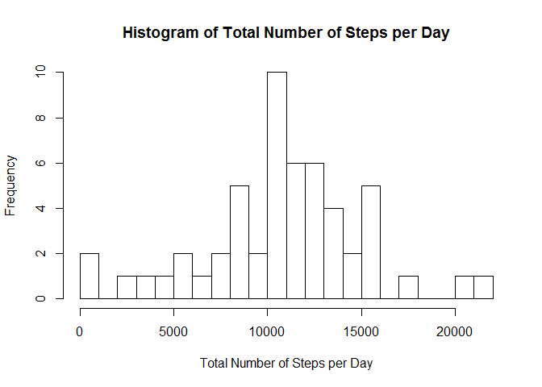
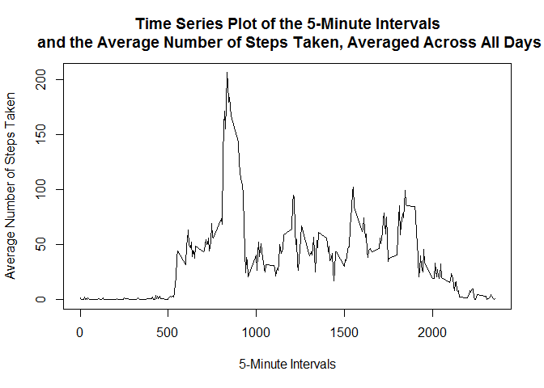
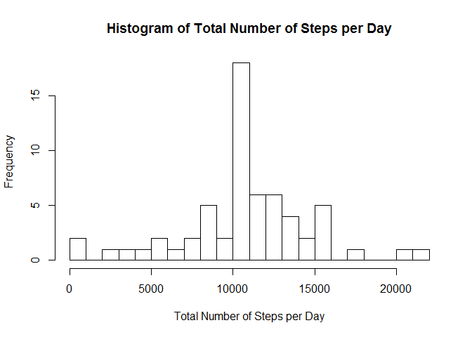
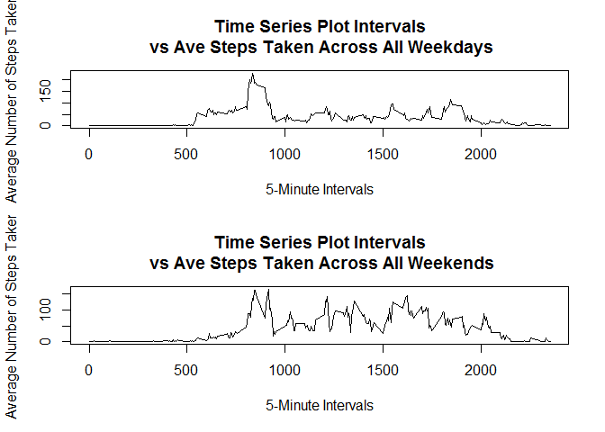

# Reproducible Research: Peer Assessment 1

## Loading and preprocessing the data
The data is already included in the original repository as *activity.zip*. The
first step is to unzip the file and read in as a csv file as **data**.


```r
unzip(zipfile="activity.zip")
data <- read.csv("activity.csv")
```

Next, we want to validate the data by doing some simple checks against the descriptions given i.e. number/names of columns, rows, summary and sample entries


```r
names(data)
```

```
## [1] "steps"    "date"     "interval"
```

```r
dim(data)
```

```
## [1] 17568     3
```

```r
head(data)
```

```
##   steps       date interval
## 1    NA 2012-10-01        0
## 2    NA 2012-10-01        5
## 3    NA 2012-10-01       10
## 4    NA 2012-10-01       15
## 5    NA 2012-10-01       20
## 6    NA 2012-10-01       25
```

```r
summary(data)
```

```
##      steps                date          interval     
##  Min.   :  0.00   2012-10-01:  288   Min.   :   0.0  
##  1st Qu.:  0.00   2012-10-02:  288   1st Qu.: 588.8  
##  Median :  0.00   2012-10-03:  288   Median :1177.5  
##  Mean   : 37.38   2012-10-04:  288   Mean   :1177.5  
##  3rd Qu.: 12.00   2012-10-05:  288   3rd Qu.:1766.2  
##  Max.   :806.00   2012-10-06:  288   Max.   :2355.0  
##  NA's   :2304     (Other)   :15840
```

We can subset the data to remove the NAs (saved as **data2**) and redisplay basic informations.


```r
data2 <- data[complete.cases(data),]
names(data2)
```

```
## [1] "steps"    "date"     "interval"
```

```r
dim(data2)
```

```
## [1] 15264     3
```

```r
head(data2)
```

```
##     steps       date interval
## 289     0 2012-10-02        0
## 290     0 2012-10-02        5
## 291     0 2012-10-02       10
## 292     0 2012-10-02       15
## 293     0 2012-10-02       20
## 294     0 2012-10-02       25
```

```r
summary(data2)
```

```
##      steps                date          interval     
##  Min.   :  0.00   2012-10-02:  288   Min.   :   0.0  
##  1st Qu.:  0.00   2012-10-03:  288   1st Qu.: 588.8  
##  Median :  0.00   2012-10-04:  288   Median :1177.5  
##  Mean   : 37.38   2012-10-05:  288   Mean   :1177.5  
##  3rd Qu.: 12.00   2012-10-06:  288   3rd Qu.:1766.2  
##  Max.   :806.00   2012-10-07:  288   Max.   :2355.0  
##                   (Other)   :13536
```

## What is mean total number of steps taken per day?
For this part of the assignment, you can ignore the missing values in the dataset.

1. Calculate the total number of steps taken per day
2. If you do not understand the difference between a histogram and a barplot, research the difference between them. Make a histogram of the total number of steps taken each day
3. Calculate and report the mean and median of the total number of steps taken per day*

Total number of steps per day is calculated using **aggregate** function
A histogram for "Number of steps/day" is plotted using the base graphics package.


```r
# Total steps per day
total.steps <- aggregate(steps ~ date, data = data2, FUN = sum)
head(total.steps)
```

```
##         date steps
## 1 2012-10-02   126
## 2 2012-10-03 11352
## 3 2012-10-04 12116
## 4 2012-10-05 13294
## 5 2012-10-06 15420
## 6 2012-10-07 11015
```

```r
# Histogran
hist(total.steps$steps, breaks = 25, main = "Histogram of Total Number of Steps per Day", xlab = "Total Number of Steps per Day")
```

\

```r
# Mean and Median values
mean(total.steps$steps)
```

```
## [1] 10766.19
```

```r
median(total.steps$steps)
```

```
## [1] 10765
```

```r
# Each graph in this document will be saved as a PNG image in the figure subfolder.
dev.copy(png, file = "figure/figure1.png")
```

```
## png 
##   3
```

```r
dev.off()
```

```
## png 
##   2
```

**Reminder: Figures generated by knitr are also saved in PA1_template_files\\figure-html subfolder**

## What is the average daily activity pattern?
1. Make a time series plot (i.e. type = "l") of the 5-minute interval (x-axis) and the average number of steps taken, averaged across all days (y-axis)


```r
# Calculate the mean for each time interval
steps.interval <- aggregate(steps ~ interval, data = data2, FUN = mean)

# Plot the graph
plot(steps.interval, type = "l", 
     main = "Time Series Plot of the 5-Minute Intervals\n and the Average Number of Steps Taken, Averaged Across All Days",
     xlab = "5-Minute Intervals",
     ylab = "Average Number of Steps Taken")
```

\

```r
# Save the Image
dev.copy(png, file = "figure/figure2.png")
```

```
## png 
##   3
```

```r
dev.off()
```

```
## png 
##   2
```

2. Which 5-minute interval, on average across all the days in the dataset, contains the maximum number of steps?


```r
steps.interval[which.max(steps.interval$steps),]
```

```
##     interval    steps
## 104      835 206.1698
```

## Imputing missing values

Note that there are a number of days/intervals where there are missing values (coded as NA). The presence of missing days may introduce bias into some calculations or summaries of the data.


```r
missing <- is.na(data$steps)
# How many missing - TRUE
table(missing)
```

```
## missing
## FALSE  TRUE 
## 15264  2304
```

2. Devise a strategy for filling in all of the missing values in the dataset. The strategy does not need to be sophisticated. For example, you could use the mean/median for that day, or the mean for that 5-minute interval, etc.

All of the missing values are filled in with mean value for that 5-minute
interval (calculated above in **steps.interval**). This operation is applied by merging the calculated values into the original table (which contained the NAs). The resulting table will have the same number of rows as the original.

3. Create a new dataset that is equal to the original dataset but with the missing data filled in.


```r
# Create a copy of the original data for modification
data3 <- data

# Use merge to create a new column that copies the corresponding mean value to the interval
data3 <- merge(data3, steps.interval, by = "interval", suffixes = c("",".y"))

# Create a vector for the location of the NAs in steps
nas <- is.na(data3$steps)

# Replace the value from the mean
data3$steps[nas] <- data3$steps.y[nas]

# keep on the original columns
data3 <- data3[, c(1:3)]
```

4. Make a histogram of the total number of steps taken each day and Calculate and report the mean and median total number of steps taken per day. Do these values differ from the estimates from the first part of the assignment? What is the impact of imputing missing data on the estimates of the total daily number of steps?
1. Calculate and report the total number of missing values in the dataset (i.e. the total number of rows with NAs)    

Repeat the earlier calculations to obtain the histogram, mean and median to now include the filled-in NAs rows.


```r
# Total steps per day
total2.steps <- aggregate(steps ~ date, data = data3, FUN = sum)
head(total2.steps)
```

```
##         date    steps
## 1 2012-10-01 10766.19
## 2 2012-10-02   126.00
## 3 2012-10-03 11352.00
## 4 2012-10-04 12116.00
## 5 2012-10-05 13294.00
## 6 2012-10-06 15420.00
```

```r
# Histogram
hist(total2.steps$steps, breaks = 25, main = "Histogram of Total Number of Steps per Day", xlab = "Total Number of Steps per Day")
```

\

```r
# Mean and Median
mean(total2.steps$steps)
```

```
## [1] 10766.19
```

```r
median(total2.steps$steps)
```

```
## [1] 10766.19
```

```r
# Save the figure
dev.copy(png, file = "figure/figure3.png")
```

```
## png 
##   3
```

```r
dev.off()
```

```
## png 
##   2
```

The median value is only slightly higher. This is the because the original values were calculated with the NA rows removed. The new calculation only 'pushes' the mean and median toward the earlier values by increasing the total sample size using calculated mean values from the subsetted data. 

## Are there differences in activity patterns between weekdays and weekends?
For this part the weekdays() function may be of some help here. Use the dataset with the filled-in missing values for this part.

1. Create a new factor variable in the dataset with two levels - "weekday" and "weekend" indicating whether a given date is a weekday or weekend day.


```r
# Create a function to classify the day. The date will need to be read as a valid date class
typeOfDay<- function(date) {
    if (weekdays(as.POSIXlt(date)) %in% c("Saturday", "Sunday")) {
        "weekend"
    } else {
        "weekday"
    }
}
data3$daytype <- as.factor(sapply(data3$date, typeOfDay))
```

2. Make a panel plot containing a time series plot (i.e. type = "l") of the 5-minute interval (x-axis) and the average number of steps taken, averaged across all weekday days or weekend days (y-axis). See the README file in the GitHub repository to see an example of what this plot should look like using simulated data.


```r
# Calculate the averages by subsetting the daytype
steps.weekday <- aggregate(steps ~ interval, data = data3, FUN = mean, subset = data3$daytype == "weekday")
steps.weekend <- aggregate(steps ~ interval, data = data3, FUN = mean, subset = data3$daytype == "weekend")

# Create the panel plot, 2 x 1
par(mfrow = c(2, 1))
# Plot for Weekdays
plot(steps.weekday, type = "l", 
     main = "Time Series Plot Intervals\n vs Ave Steps Taken Across All Weekdays",
     xlab = "5-Minute Intervals",
     ylab = "Average Number of Steps Taken")

# Plot for Weekends
plot(steps.weekend, type = "l", 
     main = "Time Series Plot Intervals\n vs Ave Steps Taken Across All Weekends",
     xlab = "5-Minute Intervals",
     ylab = "Average Number of Steps Taken")
```

\

```r
# Save the figure
dev.copy(png, file = "figure/figure4.png")
```

```
## png 
##   3
```

```r
dev.off()
```

```
## png 
##   2
```

The 2 graphs show significant differences in the activity of the individual during the weekday and weekends. The individual was more active, taking more steps during the daytime periods.
